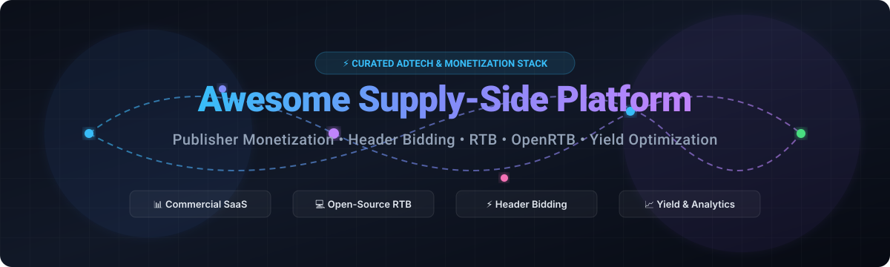

<div align="center">



# 🚀 Awesome Supply-Side Platform (SSP) Ecosystem

<p align="center">
  <strong>Curated Directory of Commercial SaaS Products & Open-Source Projects for Digital Publishers, Programmatic Advertising, Header Bidding, OpenRTB & Yield Optimization</strong>
</p>

<p align="center">
  <a href="https://github.com/ishandutta2007/Awesome-Awesome-Awesome"></a><a href="https://discord.gg/jc4xtF58Ve"></a> <a href="https://github.com/ishandutta2007/Awesome-Supply-Side-Platform/stargazers"></a> <a href="https://github.com/ishandutta2007/Awesome-Supply-Side-Platform/network/members"></a> <a href="https://github.com/ishandutta2007/Awesome-Supply-Side-Platform/blob/main/LICENSE"></a> <a href="https://github.com/ishandutta2007"></a>
</p>

<p align="center">
  <em>Last updated: August 2026</em>
</p>

</div>

---

## 📖 Overview

This repository tracks the complete programmatic ad tech landscape for **Supply-Side Platforms (SSPs)**, **Header Bidding Wrappers**, **Ad Servers**, **Ad Exchanges**, and **Open-Source RTB Infrastructure**. These platforms empower digital publishers, app developers, CTV broadcasters, and media owners to maximize yield, orchestrate multiple demand sources, and monetize impressions across display, video, connected TV (CTV/OTT), native, audio, and mobile in-app environments.

Key programmatic capabilities covered:
* ⚡ **Real-Time Bidding (RTB & OpenRTB 2.x/3.x)** protocols and low-latency auction engines.
* 🔄 **Client-side & Server-side Header Bidding** (Prebid.js, Prebid Server, Amazon APS).
* 📈 **Yield Optimization & Dynamic Floor Pricing** to maximize publisher eCPM.
* 🛡️ **Supply Path Optimization (SPO), Brand Safety, and Fraud Prevention** (ads.txt, app-ads.txt, sellers.json, schain).
* 🆔 **Addressability & Identity Resolution** (Unified ID 2.0, ID5, LiveRamp RampID, Yahoo ConnectID, SharedID).
* 🔒 **Privacy & Consent Compliance** (TCF v2.2, US Privacy, GPP).

---

## 📑 Table of Contents

- [🏢 Commercial SaaS & Hosted Platforms](#-commercial-saas--hosted-platforms)
- [💻 Open-Source GitHub Projects](#-open-source-github-projects)
- [🧱 Open-Source Building Blocks](#-open-source-building-blocks)
- [🏗️ Typical Open-Source SSP Architecture](#️-typical-open-source-ssp-architecture)
- [🔍 Key SSP Capabilities to Evaluate](#-key-ssp-capabilities-to-evaluate)
- [⚖️ Commercial SSP vs Open-Source Stack](#-commercial-ssp-vs-open-source-stack)
- [🤝 How to Contribute](#-how-to-contribute)
- [⭐ Star History](#-star-history)
- [⚠️ Disclaimer](#️-disclaimer)

---

## 🏢 Commercial SaaS & Hosted Platforms

> 🌐 **Market Overview & Industry Structure:** The global Supply-Side Platform (SSP) and Programmatic Advertising market is estimated at **$60B–$120B+** (as part of the $600B+ digital ad industry). The sector is **moderately concentrated at the top tier** (anchored by major tech giants and publicly traded exchanges like Microsoft Xandr, Google Ad Manager, Amazon Publisher Services, Magnite, and PubMatic) alongside a **highly fragmented ecosystem** of specialized programmatic platforms spanning Connected TV (CTV), mobile mediation, retail media, native ad units, and private marketplaces (PMPs).

| Platform / Vendor | Market Cap / Valuation / Est. Revenue | Description & Core Capabilities | Pricing (Starting Tier / Commercial Model) | Free Tier / Free Trial Limits |
| :--- | :--- | :--- | :--- | :--- |
| **Microsoft Advertising (Xandr Monetize)** | **~$3.1 Trillion** (Microsoft Market Cap) | Enterprise sell-side monetization technology connecting publishers to global programmatic demand through header bidding, direct deals, and private marketplaces (PMPs). | **Seller Auction Service Charge (SASC) starting at ~10%–15%** take rate or ~$0.01–$0.03 tech fee CPM. | **Free API sandbox testing & developer documentation access** during contractual partner onboarding. |
| **Google Ad Manager (GAM)** | **~$2.1 Trillion** (Alphabet Market Cap) | Google's flagship publisher monetization platform combining ad serving, programmatic demand (AdX), direct campaign pacing, yield optimization, and unified pricing rules. | Free standard tier; GAM 360 enterprise contracts start at **~$1,500–$3,000/month minimum** (~$100k/year enterprise agreement). | **Free forever** up to 90M non-video impressions/month (US/CA/ANZ/Europe) or 200M non-video impressions/month (other regions); 800k video impressions/month. |
| **Amazon Publisher Services (APS)** | **~$2.1 Trillion** (Amazon Market Cap) | Cloud-based server-to-server header bidding infrastructure (Transparent Ad Marketplace / TAM & Unified Ad Marketplace / UAM) with direct Amazon demand and shopper insights. | **10% publisher transaction fee** deducted from buyer bids before entering auction (Transparent Ad Marketplace / TAM). | **Free publisher registration & SDK integration** with zero recurring monthly subscription or maintenance fees. |
| **Yahoo SSP** | **~$7.0 Billion** (Apollo Global Mgmt) | Omnichannel sell-side monetization platform offering premium programmatic demand, identity resolution (Yahoo ConnectID), and server-side header bidding. | **Programmatic take rate starting at ~10%–15%** on publisher inventory transactions. | **Free publisher onboarding, ConnectID integration, and yield test period** with no upfront fees. |
| **Magnite** | **~$2.2 Billion** (NASDAQ: MGNI / $650M+ Rev) | The world's largest independent sell-side advertising platform, specializing in connected TV (CTV), video, streaming audio, display, and mobile programmatic monetization. | **Dynamic take rate starting at ~10%–15%** revenue share on cleared CTV and programmatic ad revenue. | **Free partner onboarding and contract evaluation**; live test-traffic auction analysis during publisher integration. |
| **TripleLift** | **~$1.4 Billion** (Vista Equity Partners / $150M+ Rev) | Leading programmatic platform specializing in custom native advertising, in-feed display, interactive CTV, and retail media monetization. | **Programmatic take rate starting at ~15%–20%** revenue share on native and premium ad placements. | **Free tag/adapter implementation & creative rendering sandbox** testing prior to live monetization. |
| **PubMatic** | **~$1.0 Billion** (NASDAQ: PUBM / $290M+ Rev) | Cloud infrastructure platform for publishers and app developers, delivering OpenWrap wrapper management, identity hub, omnichannel RTB, and supply-path optimization. | **Dynamic take rate starting at ~10%–13%** revenue share on publisher impression volume. | **Free publisher registration & OpenWrap wrapper integration** with no recurring software license fees. |
| **StackAdapt** | **~$1.0 Billion+** (Unicorn / $150M+ Rev) | Multi-channel programmatic advertising platform with extensive publisher supply connectivity across CTV, audio, native, display, and in-game ads. | **$0 monthly platform software fee** (self-serve tier; recommended starting ad spend of $1,000–$2,000/month; managed service from $5,000/month). | **Free platform account registration** with full UI access and free enrollment in Programmatic Masterclass certification. |
| **Nexxen** | **~$600 Million** (NASDAQ: NEXN / $340M+ Rev) | Unified advertising platform combining sell-side SSP infrastructure, discovery data, TV view graphs, and exchange-level monetization across connected TV and video. | **Programmatic take rate starting at ~12%–18%** on video, CTV, and omnichannel media spend. | **Free platform demo walkthrough and trial pilot evaluation** for verified publisher inventory. |
| **Index Exchange** | **~$500 Million+** (Private / $180M+ Rev) | Global independent ad exchange providing transparent programmatic marketplaces, client audit logs (CAL), and omnichannel header bidding decisioning. | **Transparent dynamic take rate starting at ~10%–12%** per-impression transaction fee. | **Free publisher integration and Client Audit Log access** with zero upfront setup or licensing fees. |
| **Equativ** | **~$500 Million+** (Bridgepoint / $120M+ Rev) | Vertically integrated independent ad tech platform (merged with Sharethrough) delivering end-to-end programmatic supply infrastructure, curation, and native formats. | **Programmatic take rate starting at ~10%–15%** margin / CPM-based targeting fee on auction transactions. | **Free publisher evaluation & SDK integration sandbox** during partner onboarding. |
| **Adform** | **~$300 Million+** (Valuation / $80M+ Rev) | European integrated programmatic platform offering enterprise ad serving, media buying, ID Fusion identity infrastructure, and publisher yield management. | **Platform tech fee starting at ~$0.05–$0.15 CPM** or custom annual licensing for enterprise stack. | **Guided proof-of-concept / paid pilot period** with demo sandbox environment access. |
| **OpenX** | **~$250 Million+** (Valuation / $100M+ Rev) | 100% cloud-based programmatic exchange and SSP connecting premium publisher inventory with global DSP demand across web, mobile, and CTV. | **Programmatic revenue share starting at ~10%–15%** take rate on auction clearing prices. | **Free publisher onboarding & OpenRTB tag integration** with access to OpenX Community tools (traffic volume thresholds apply). |
| **Sovrn** | **~$200 Million+** (Valuation / $80M+ Rev) | Publisher technology platform delivering programmatic header bidding, affiliate commerce monetization (Sovrn Commerce), and audience analytics. | **Flat CPM platform fee** (0% rev-share take rate when bundling Ad Management + Exchange) or standard ~15%–20% exchange rev-share. | **Free publisher signup and onboarding** with no upfront setup fees (requires minimum 10,000 monthly pageviews). |
| **Yieldmo** | **~$150 Million+** (Valuation / $50M+ Rev) | Ad exchange and optimization engine specializing in proprietary mobile attention formats, contextual AI targeting, and micro-moment yield optimization. | **Programmatic take rate starting at ~15%–20%** on proprietary high-engagement mobile ad units. | **Free tag integration & A/B yield test period** with zero upfront onboarding fees. |
| **Kevel** | **~$100 Million+** (Valuation / $25M+ Rev) | API-first ad infrastructure platform enabling publishers, marketplaces, and retailers to build custom ad servers, sponsored products, and retail media networks. | **Starting tier at $3,000/month** (base API tier with standard request volume); custom scaling for enterprise deployments. | **Interactive developer sandbox & API test environment** during guided sales onboarding (no self-serve free tier). |
| **Onetag** | **~$100 Million+** (Valuation / $35M+ Rev) | Smart programmatic exchange utilizing machine learning to eliminate non-performing bid requests, reduce latency, and maximize publisher yield. | **Auction-based take rate starting at ~10%–15%** on direct programmatic demand routing. | **Free publisher header-bidding adapter setup & test-auction traffic analysis**. |
| **Bidtellect** | **~$100 Million+** (Simplifi / $30M+ Rev) | Programmatic platform focused on context-driven native advertising, brand-safe supply monetization, and dynamic creative delivery. | **Programmatic revenue share starting at ~15%–20%** on native and contextual campaign delivery. | **Free publisher tag onboarding & initial campaign performance test period**. |
| **AdButler** | **~$30M–$50M** (Sparklit / $12M+ Rev) | Fast, hosted ad server providing direct-sold campaign management, header bidding mediation, programmatic demand passback, and zone targeting. | **Essentials tier starts at $179/month** (up to 1M requests); Standard at $399/month; Advanced at $699/month. | **14-day free trial** with full platform feature access and 30 days of free onboarding support. |
| **Broadstreet** | **~$15M–$25M** (Valuation / $6M+ Rev) | Publisher-first ad server designed specifically for hyper-local news publishers, regional media companies, industry trade publications, and newsletters. | **Manual tier starts at $299/month**; Automatic tier starts at $399/month; Enterprise custom pricing. | **Live sandbox demo** on request + free permanent access to "Daybreak" publisher lead-generation tools. |
| **AdGlare** | **~$10M–$20M** (Valuation / $3M+ Rev) | Cloud-based ad server providing white-label ad serving, geotargeting, conversion tracking, custom campaigns, and display/video delivery. | **Lite tier starts at $99/month** (up to 2M requests); Professional at $349/month (up to 10M requests); Enterprise at $649/month. | **14-day free trial** with all features unlocked and up to 10,000,000 ad requests. |

---

## 💻 Open-Source GitHub Projects

The open-source ad tech ecosystem provides critical building blocks for building sovereign, publisher-owned auction stacks, ad servers, header bidding wrappers, and real-time data pipelines.

> 🌟 Repositories are ranked below in descending order by GitHub star count.

### 🏆 Top Open-Source Projects (Ranked by Stars)

| Repository | Stars | Category / Focus | Description |
| :--- | :---: | :--- | :--- |
| [**MinIO**](https://github.com/minio/minio) | [](https://github.com/minio/minio/stargazers) | Creative / Event Storage | High-performance, S3-compatible object storage widely used for self-hosted creative assets, auction log dumps, and tracking payloads. |
| [**ClickHouse**](https://github.com/ClickHouse/ClickHouse) | [](https://github.com/ClickHouse/ClickHouse/stargazers) | Analytics Data Warehouse | Ultra-fast columnar database engine used for real-time bid-stream analysis, win/loss analytics, eCPM yield reporting, and fraud detection. |
| [**Matomo**](https://github.com/matomo-org/matomo) | [](https://github.com/matomo-org/matomo/stargazers) | Analytics & Traffic | Leading privacy-first web analytics platform providing publisher traffic, pageview, and audience insights with 100% data ownership. |
| [**Prebid.js**](https://github.com/prebid/Prebid.js) | [](https://github.com/prebid/Prebid.js/stargazers) | Header Bidding | The industry-standard open-source client-side header bidding framework enabling publishers to run simultaneous auctions across 300+ demand partners. |
| [**Revive Adserver**](https://github.com/revive-adserver/revive-adserver) | [](https://github.com/revive-adserver/revive-adserver/stargazers) | Open-Source Ad Server | The most popular open-source ad serving system. Supports publisher inventory, direct campaign delivery, geo-targeting, frequency capping, and click/impression tracking. |
| [**RTBkit**](https://github.com/rtbkit/rtbkit) | [](https://github.com/rtbkit/rtbkit/stargazers) | RTB Core Engine | Modular, high-performance C++ real-time bidding framework providing building blocks for RTB exchanges, auction routers, and DSP/SSP bidding engines. |
| [**Prebid Server (Go)**](https://github.com/prebid/prebid-server) | [](https://github.com/prebid/prebid-server/stargazers) | Server-Side Auction / SSP | Production-grade server-side header bidding and auction engine implemented in Go. Supports OpenRTB, dynamic floor pricing, privacy modules, and supply chains. |
| [**IAB Tech Lab OpenRTB**](https://github.com/InteractiveAdvertisingBureau/openrtb) | [](https://github.com/InteractiveAdvertisingBureau/openrtb/stargazers) | Protocol Specification | Official IAB repository containing OpenRTB protocol specifications (2.5, 2.6, 3.0), AdCOM, and OpenRTB JSON schemas for automated ad transactions. |
| [**BSM OpenRTB (Go)**](https://github.com/bsm/openrtb) | [](https://github.com/bsm/openrtb/stargazers) | OpenRTB Go Library | Fast OpenRTB 2.x protocol parser and data structures in Go, optimized for low-latency serialization in real-time bidding applications. |
| [**Prebid Universal Creative**](https://github.com/prebid/prebid-universal-creative) | [](https://github.com/prebid/prebid-universal-creative/stargazers) | Creative Rendering | Cross-environment creative rendering script ensuring seamless display, native, and video ad delivery across web, AMP, and mobile web ad slots. |
| [**Google OpenRTB (Java)**](https://github.com/google/openrtb) | [](https://github.com/google/openrtb/stargazers) | OpenRTB Java Library | Google's reference OpenRTB implementation providing Protobuf and JSON models for Java-based real-time bidding exchanges and DSPs. |
| [**Prebid Server (Java)**](https://github.com/prebid/prebid-server-java) | [](https://github.com/prebid/prebid-server-java/stargazers) | Server-Side Auction (Java) | Java/Vert.x implementation of Prebid Server providing high-throughput asynchronous auction handling, bidder adapters, and analytics hooks. |
| [**Prebid Mobile Android**](https://github.com/prebid/prebid-mobile-android) | [](https://github.com/prebid/prebid-mobile-android/stargazers) | Mobile App SDK | Native Android SDK for header bidding monetization across mobile applications, integrating with Google GMA SDK and GAM. |
| [**Prebid Mobile iOS**](https://github.com/prebid/prebid-mobile-ios) | [](https://github.com/prebid/prebid-mobile-ios/stargazers) | Mobile App SDK | Native iOS / Swift SDK bringing Prebid auction and rendering capabilities to iPhone, iPad, and Apple tvOS environments. |
| [**Prebid OpenRTB (Go Models)**](https://github.com/prebid/openrtb) | [](https://github.com/prebid/openrtb/stargazers) | Protocol Models | Go language OpenRTB 2.x and 3.x data structs maintained by Prebid.org for high-speed serialization within Prebid Server. |
| [**OpenSSP**](https://github.com/OpenSSP/open-ssp) | [](https://github.com/OpenSSP/open-ssp/stargazers) | Purpose-Built SSP | Java-based open-source supply-side platform designed for multi-channel RTB decisioning, demand connectivity, and ad exchange functions. |
| [**ZenAd**](https://github.com/zenad/zenad) | [](https://github.com/zenad/zenad/stargazers) | Modern Ad Server / SSP | Apache-2.0 open-source ad monetization platform combining SSP, ad server, and DMP capabilities with a federated auction architecture. |
| [**Ad Nano**](https://github.com/ad-nano/ad-nano) | [](https://github.com/ad-nano/ad-nano/stargazers) | Experimental Full Stack | End-to-end lightweight ad tech ecosystem containing publisher tag, SSP, DSP, exchange, and ad-rendering components for experimentation. |

---

## 🧱 Open-Source Building Blocks

| Architectural Layer | Recommended Open-Source Solutions | Functional Purpose |
| :--- | :--- | :--- |
| **SSP / Auction Core** | `Prebid Server (Go/Java)`, `OpenSSP`, `ZenAd` | Real-time OpenRTB auction decisioning, bidder routing, and timeout management. |
| **Client Header Bidding** | `Prebid.js` | Browser-side multi-demand auctions, user syncs, and slot orchestration. |
| **Mobile Header Bidding** | `Prebid Mobile (Android/iOS)` | In-app mobile monetization and mediation integration (Google GMA SDK). |
| **Ad Server / Campaign Manager** | `Revive Adserver` | Direct-sold campaign management, pacing, targeting, frequency capping, and fallbacks. |
| **RTB Protocol Models** | `IAB OpenRTB`, `BSM OpenRTB`, `Google OpenRTB` | Standardized communication schemas between SSPs, DSPs, and exchanges. |
| **Demand Bid Adapters** | `Prebid Server Adapters`, `Prebid.js Adapters` | Connect 300+ demand partners (Magnite, PubMatic, OpenX, Index, Amazon, etc.). |
| **Dynamic Floor Pricing** | `Prebid Price Floors Module` | Dynamic floor rules and ML-driven yield optimization based on contextual signals. |
| **Supply Chain Transparency** | `Prebid schain module`, `sellers.json` | Supply-path verification and cryptographic seller transparency. |
| **Privacy & Consent** | `Prebid Consent Management (TCF v2.2, USP, GPP)` | GDPR consent strings, US state privacy signaling, and Google Consent Mode. |
| **Identity & Addressability** | `Prebid User ID Module (UID2, ID5, SharedID)` | Universal identity resolution without reliance on third-party cookies. |
| **Publisher Analytics** | `Matomo` | Privacy-centric self-hosted audience, traffic, and content performance analytics. |
| **Real-Time Dashboards** | `Grafana` | Visualizing live auction revenue, fill rates, eCPMs, and bidder response latency. |
| **Metrics & Telemetry** | `Prometheus` | Collecting sub-millisecond metrics on auction timeouts, error rates, and throughput. |
| **Stream Processing** | `Apache Kafka` | High-throughput distributed event streaming for bid requests, wins, and clicks. |
| **High-Volume Data Warehouse** | `ClickHouse` | Real-time analytical queries on billions of daily impression and bid-stream records. |
| **Low-Latency Cache** | `Redis` | Sub-millisecond lookup for floor prices, user frequency caps, and targeting criteria. |
| **Configuration Database** | `PostgreSQL` | Relational storage for publisher metadata, placement configs, deals, and audit logs. |
| **Asset Storage** | `MinIO` | S3-compatible self-hosted object storage for creative creatives, logs, and tracking data. |
| **Log Search Engine** | `OpenSearch` | Ingesting and querying raw auction logs, bidder errors, and audit traces. |
| **Data Pipelines & ETL** | `Apache Airflow` | Orchestrating daily revenue reconciliation, billing reports, and data aggregations. |
| **Container Infrastructure** | `Docker` / `Kubernetes` | Containerization, auto-scaling, and multi-region low-latency edge deployment. |
| **API Gateway** | `Kong` | Rate limiting, authentication, and routing for external publisher and bidder APIs. |
| **Distributed Tracing** | `OpenTelemetry` | End-to-end tracing of bid request lifecycles from wrapper to SSP to DSP. |

---

## 🏗️ Typical Open-Source SSP Architecture

A modern, publisher-owned self-hosted SSP stack orchestrates the following flow:

```
[Publisher Web / App / CTV]
             │
             ├──► Prebid.js (Client-Side Header Bidding)
             └──► Prebid Server (Server-Side Auction Engine)
                         │
                         ├──► OpenRTB 2.5 / 3.0 Protocol Engine
                         ├──► Demand Adapters (DSP / Exchange Connections)
                         ├──► Dynamic Price Floor Engine (Redis Cache)
                         ├──► Identity Resolution (UID2 / ID5 / SharedID)
                         └──► Direct Campaigns Fallback (Revive Adserver)
                                     │
                                     ▼
                   [Event Stream: Apache Kafka]
                                     │
                   ┌─────────────────┴─────────────────┐
                   ▼                                   ▼
          [ClickHouse Warehouse]             [MinIO Object Storage]
                   │                                   │
                   ▼                                   ▼
        [Grafana / Prometheus]               [Raw Log Archive / ETL]
        (Real-Time Yield Dashboards)         (Airflow Billing Pipelines)
```

1. **Publisher Client:** Collects user consent, triggers Prebid.js / Prebid Mobile SDK, and sends impression slots to auction.
2. **Prebid Server:** Evaluates dynamic floor prices from **Redis**, resolves user IDs, and broadcasts OpenRTB bid requests to hundreds of DSPs.
3. **Revive Adserver:** Serves direct-sold sponsor campaigns or fallback house creatives if programmatic floor is not met.
4. **Kafka & ClickHouse:** Streams every bid request, bid response, win, impression, and click for real-time eCPM yield tracking.
5. **Grafana Dashboards:** Delivers instant observability into bidder latency, timeout rates, fill rates, and publisher revenue.

---

## 🔍 Key SSP Capabilities to Evaluate

When selecting or architecting a Supply-Side Platform, evaluate these foundational pillars:

* ⚡ **Auction Mechanics:** First-price auctions, header bidding mediation, multi-bid support, and dynamic floor pricing.
* 🌐 **Protocol Compliance:** OpenRTB 2.5/2.6/3.0, OpenRTB Dynamic Native 1.2, VAST 4.x, and SIMID.
* 📱 **Channel Coverage:** Web display, Accelerated Mobile Pages (AMP), mobile apps (iOS/Android), CTV/OTT video, digital audio, and DOOH.
* 🤝 **Direct & Deal Capabilities:** Programmatic Guaranteed (PG), Private Marketplaces (PMP), Preferred Deals, and curated marketplaces.
* 🛡️ **Supply Integrity & Anti-Fraud:** Automated ads.txt / app-ads.txt validation, sellers.json generation, SupplyChain Object (schain) injection, and bot-traffic filtering.
* 🆔 **Identity & Addressability:** First-party data activation, alternative ID modules (Unified ID 2.0, ID5, LiveRamp, Yahoo ConnectID), and Google Privacy Sandbox support.
* 📊 **Yield & Reporting:** Sub-millisecond log-level data (LLD), bid density reports, win-rate analytics, latency monitoring, and discrepancy resolution.
* 🔒 **Data Ownership & Privacy:** Full sovereignty over log-level auction data, user consent telemetry (GDPR, CCPA/CPRA, GPP), and regional compliance.

---

## ⚖️ Commercial SSP vs Open-Source Stack

| Feature / Dimension | Commercial Hosted SSP | Publisher Open-Source Stack |
| :--- | :--- | :--- |
| **Auction Engine** | Fully vendor-managed & maintained | Self-hosted (Prebid Server / OpenSSP) |
| **Demand Connectivity** | Built-in relationships with major DSPs | Requires direct DSP contracts or adapter configs |
| **Platform Take Rate** | Typically **10%–20%** revenue share deduction | **0% platform fee** (infrastructure hosting costs only) |
| **Data Ownership** | Controlled and aggregated by vendor | **100% first-party publisher ownership** |
| **Auction Customization** | Restricted to vendor's proprietary logic | Fully customizable auction rules, floors, and bidder pacing |
| **Header Bidding** | Often vendor wrapper or proprietary SDK | Industry-standard Prebid.js / Prebid Server |
| **Direct Campaign Management** | Included in enterprise packages | Managed via Revive Adserver or custom ad server |
| **Setup & Maintenance Effort** | Low engineering overhead; fast onboarding | Requires DevOps, Kubernetes scaling, and ad tech engineers |
| **Transparency** | Vendor-dependent reporting & logs | Full code-level and log-level transparency |

---

## 🤝 How to Contribute

Contributions are welcome! Help make this the most comprehensive and up-to-date guide to the Supply-Side Platform ecosystem:

1. 🍴 **Fork** this repository.
2. ➕ **Add or update** entries in `README.md` following the established format:
   - For SaaS: include platform name, estimated valuation/revenue, capabilities, specific starting pricing, and exact free tier/trial limits.
   - For Open-Source: include repo link, star badge (`style=social&color=white`), category, and descriptive summary.
3. 🔗 **Link to official resources:** Use official vendor websites or canonical GitHub repositories.
4. 📝 **Submit a Pull Request** with a clear explanation of your changes.
5. ⭐ **Star this repository** to support the project!

---

## ⭐ Star History

[](https://star-history.dera.page/#ishandutta2007/Awesome-Supply-Side-Platform&type=date&legend=top-left)

---

## ⚠️ Disclaimer

* This repository is a community-curated directory intended for educational, architectural, and informational purposes. It does not constitute an endorsement.
* Commercial SSPs, ad exchanges, and ad servers frequently update their feature sets, corporate ownership, pricing structures, and terms of service.
* Programmatic revenue outcomes depend on multiple dynamic variables including inventory volume, audience geography, domain authority, format mix, viewability, latency, and direct buyer relationships.
* Advertising infrastructure processes user data and must comply with applicable privacy regulations (e.g., GDPR, CCPA/CPRA, ePrivacy Directive). Publishers are responsible for implementing appropriate consent and data governance mechanisms.

---

<div align="center">
  <sub>Maintained with ❤️ for publishers, media companies, ad-tech engineers, and programmatic teams worldwide.</sub>
</div>
